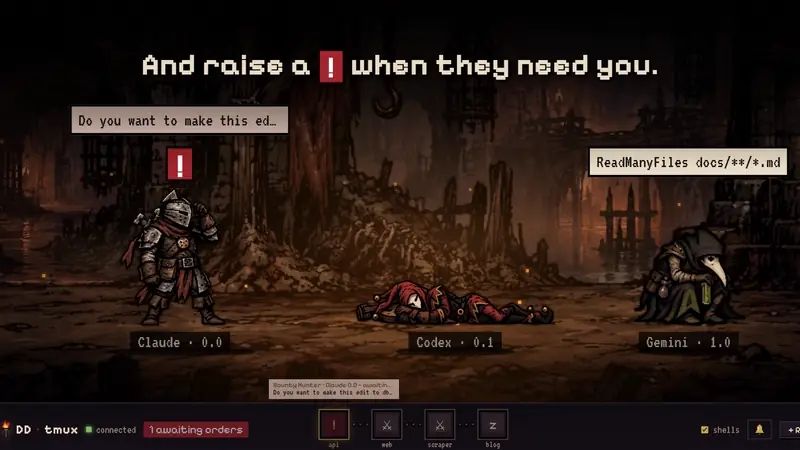

# DD-tmux

**Your AI coding agents, as a Darkest Dungeon party.**

You run Claude Code in one tmux session, Codex in another, Gemini in a third… and you keep
missing the one that has been sitting on *"Do you want to make this edit?"* for ten minutes.
DD-tmux turns every tmux session into a torch-lit dungeon room and every agent into a hero, so
one glance tells you who is working, who is done and who needs you.



<sub> Want it with sound? [Watch the full demo video](docs/demo.mp4).</sub>

## What it does

- **Agents fight while they work, sleep when they're done.** DD-tmux watches every tmux pane,
  finds the agent running in it and animates its hero to match: fighting while the screen changes,
  asleep once the turn is over.
- **❗ when an agent needs you.** Permission prompts (`Do you want to…`, `(y/n)`, `Allow…`)
  raise an alert over the hero, light up its room on the map, change the tab title and play a chime.
- **A chime when an agent finishes.** When a turn ends you hear it, so you can go do something else
  while your agents work. Asking and finishing sound different; one click on the bell mutes both.
- **Click a hero, you're in its terminal.** A live terminal opens in a side panel: type straight
  into it, press `1`/`y`/`Esc` with one click, or send a longer order.
- **Code tab: only what the agent changed.** See each captured edit in red and green. New rooms
  launched from DD-tmux enable edit tracking for Claude, Codex, Gemini, OpenCode and Copilot.
- **Chronicle.** Every order, key press, state change and turn result is kept in Postgres, grouped by turn.
- **A map of your whole dungeon.** One room per tmux session, joined by corridors, each with a
  bubble showing what its agents are doing right now.
- **14 agents detected out of the box:** Claude, Codex, Gemini, Aider, OpenCode, Cursor, Copilot,
  Qwen, Goose, Crush, Amp, Droid, Kiro and Cline. Plain shells get a hero too.
- **7 heroes and 4 animated rooms included** (embers, fireflies, storm, falling ash), and you can add your own.
- **Private by design.** It listens only on `127.0.0.1` and requires a token; reach it from your
  phone through Tailscale or Cloudflare Tunnel.

## Quick start

**Needs:** tmux, PostgreSQL and [uv](https://docs.astral.sh/uv/) (Python). The setup script installs tmux and uv
if they're missing. Written for WSL; plain Debian/Ubuntu works the same way. On macOS, install tmux, uv and
Postgres yourself and follow the steps in `scripts/setup-wsl.sh`.

```bash
git clone https://github.com/Ton-Llop/DD-tmux && cd DD-tmux
bash scripts/postgres-local.sh      # only if you don't have Postgres on the homelab yet
bash scripts/setup-wsl.sh           # uv sync (backend/.venv) + backend/.env with a token
mkdir -p ~/.local/bin && ln -sf "$PWD/scripts/dd-tmux" ~/.local/bin/dd-tmux   # ~/.local/bin must be on your PATH
dd-tmux                             # starts in the background and opens http://localhost:8765
```

- `dd-tmux stop` stops it, `dd-tmux log` shows the log, `dd-tmux start` starts it without opening the browser. In the foreground: `bash scripts/start.sh`.
- With the backend running, frontend and sprite changes only need a page reload
  (Ctrl+F5). Backend changes (`backend/app/`) need `dd-tmux stop && dd-tmux`.
- The web asks for the token printed by `setup-wsl.sh` (`TD_AUTH_TOKEN` in `backend/.env`).

Launch your agents as usual (`tmux new -s api` → `claude`) and they show up on their own.
You can also create rooms from the web with **+ Room**.

### Postgres on the homelab

Bring up `backend/docker-compose.postgres.yml` in a Proxmox LXC/VM and change
`TD_DATABASE_URL` in `backend/.env`. Restrict port 5432 to your LAN with the Proxmox firewall.

### Start it together with tmux (optional)

So you never have to type `dd-tmux`: add this line to `~/.tmux.conf` and DD-tmux starts in the
background every time you create a tmux session (if it's already running, nothing happens):

```tmux
set-hook -g session-created 'run-shell -b "$HOME/.local/bin/dd-tmux start"'
```

Reload it with `tmux source-file ~/.tmux.conf` (or restart tmux), then keep http://localhost:8765
open or bookmarked. It's plain tmux config, so it works the same on WSL and Linux.

**Always on instead:** with systemd (on WSL, enable it in `/etc/wsl.conf` → `[boot]\nsystemd=true`), copy
`backend/tmux-dungeon.service` to `~/.config/systemd/user/`, adjust the paths
(default `~/DD-tmux`) and run `systemctl --user enable --now tmux-dungeon`.

### Access from outside your home

The backend is a **remote shell**: it listens only on `127.0.0.1` and the port is never opened.
Options, all from the machine running DD-tmux:

- **Tailscale** (the simplest): `tailscale serve 8765` → `https://<your-pc>.<tailnet>.ts.net`
- **Cloudflare Tunnel + Access**: `cloudflared tunnel` to `http://localhost:8765`,
  with an Access policy (email) in front, on top of the token.

## Interface details

- **Room size**: you see one room at a time. Character
  size is set by `MAX_ZOOM` in `frontend/js/app.js` (1 = small, with the whole background in
  view; 2, 3… = bigger, always at a whole zoom factor so the pixel art doesn't warp).
- **Map** (bottom bar): the rooms joined by corridors. Each room shows **⚔** if someone is
  working, **z** if everyone rests and a red **!** if someone awaits orders. Click or **← →** to
  change room. The web remembers which room you were in.
- **Activity on the map**: above every room with someone working or waiting there's a bubble with
  what they're doing. Click it to expand it with every agent in the room and their last
  lines; click an agent to jump to its terminal.
- **Sound**: the bell in the bottom bar toggles both chimes (asking: two falling notes; finished: three rising
  notes). A turn counts as finished only after 5 s of work, and shells never chime.
- **Side panel**: **Terminal** (live, type directly), **Code** (per-agent edits),
  **Character** (pick its hero) and **Chronicle** (its history, turn by turn).
- **Animated backgrounds**: each room gets one of the manifest's backgrounds (neighbouring rooms get
  different ones) with fog and particles depending on the mood. Without custom backgrounds the stock wall is used.

## Characters

DD-tmux ships with 7 characters and 4 animated backgrounds, all declared in `manifest.json`:
Jester, Plague Doctor, Bounty Hunter, Leper, Joana, Volosin and Vagrant (the shell one).
Want more? See *Adding your own characters*. The default character for each agent type goes in
the manifest's `defaults` (`other-agent` = any agent without its own default); if missing, the first one is used.

Change them from the panel (**Character** tab):
- **This agent only** → stored by `session:window.pane`, so it survives a tmux restart
- **All Claude/Codex/…** → default for that agent type; it also clears the individual
  assignments of panes of that type, so the change reaches all of them

### Adding your own characters

1. Create a folder `frontend/sprites/custom/<id>/` with one image per state: GIFs or PNGs with a
   transparent background (`idle`, `working`, `needs_input`, optionally `dead`).
   Got a sprite sheet instead? Let `scripts/cut_sprites.py` make the GIFs (see *Cutting sprite sheets*).
2. Add an entry under `characters` in `frontend/sprites/custom/manifest.json`.
3. Reload the page (Ctrl+F5): it shows up in the **Character** tab.

Backgrounds work the same way: drop the image in `frontend/sprites/custom/bg/` and add it to `backgrounds`.
The manifest format (`manifest.example.json` is a minimal example):

```jsonc
{
  "characters": {
    "bufon": {
      "name": "Jester", "blurb": "laughs while he slits throats",
      "images": { "idle": "custom/bufon/sleep.gif", "working": "custom/bufon/lute.gif",
                  "needs_input": "custom/bufon/ask.gif", "dead": "custom/bufon/frame0.png" },
      "height": 130,          // height in "game" px; the image can be bigger (stays crisp when zoomed)
      "animated": true        // animated GIF: turns off the stock CSS animations
    }
  },
  "defaults": { "claude": "bufon" },   // optional: character per agent type
  "backgrounds": [                     // optional: room backgrounds, in this order
    { "src": "custom/bg/mazmorra.jpg", "fx": "dungeon" }   // fx: dungeon | forest | storm | ashes
  ]
}
```

Background effects: `dungeon` (embers and torchlight), `forest` (fireflies), `storm` (rain and
lightning), `ashes` (falling ash and a pulsing sky). Panoramic images (~3:1) with
the floor in the bottom third work best.

### Cutting sprite sheets

`scripts/cut_sprites.py` turns an 8-pose sheet (2 rows of 4, transparent background) into
one GIF per state, aligned by the feet and 390 px tall (3× the manifest's 130):

```bash
uv run --no-project --with pillow --with scipy scripts/cut_sprites.py [id ...]
```

Each character is a folder `frontend/sprites/custom/<id>/` with `sheet.png` and an entry in
`CHARS` inside the script. Poses are numbered 0-7 in reading order:

```python
"cazador": {
    "work": ([0, 2, 4, 3, 2, 5], [650, 550, 400, 900, 500, 950]),  # poses and ms (one for all or one per pose)
    "ask": ([6, 0], 600),
    "smooth": ["work", "ask"],               # crossfades between poses + breathing (~13 fps)
    "sleep_in_sheet": (200, 0, 444, 127),    # sleeping = the sheet's bottom-right pose;
},                                           # the box erases its baked-in z's (crop px)
```

- **Single-row sheets** (4 poses): `"rows": 1`. If two poses touch, the script splits them on its own.
- **Sleeping**: `sleep-src.png` in the folder (lying down, transparent background), `sleep_in_sheet` or
  `"sleep_pose": N` (uses sheet pose N as-is, e.g. the Leper dozes kneeling).
  The body breathes and 3 z's appear one by one (its own if they're loose; otherwise the Jester's).
- **Drawn props**: `PROPS` replaces a GIF with a custom function (e.g. `bard()`: musical
  notes coming out of the lute).

## How it detects things

- **Agent**: looks for the executable in each pane's process tree: Claude, Codex, Gemini,
  Aider, OpenCode, Cursor, Copilot, Qwen, Goose, Crush, Amp, Droid, Kiro and Cline. The list
  (`AGENTS`) is in `backend/app/tmux.py`; add yours and its name in `AGENT_LABEL`
  (`frontend/js/app.js`).
- **States**: `working` (the screen changed < 3 s ago) · `idle` · `needs_input` (the bottom
  of the screen shows "Do you want to…", "(y/n)", "Allow…") · `dead`.
  The patterns are in `backend/app/monitor.py` (`NEEDS_INPUT_RE`); add your own.
- **Chronicle**: orders and keys sent, state changes and screen captures (max. 1 every 5 s
  per pane, plus always the one at the end of each turn). Retention: `TD_RETENTION_DAYS` (14).

## Project layout

```
DD-tmux/
├── backend/      FastAPI + WebSocket + PostgreSQL (watches tmux)
├── frontend/     the web UI (served by the backend itself)
│   └── sprites/custom/   ← characters and backgrounds (add your own here)
├── docs/         demo video
└── scripts/      setup, startup and sprite cutter
```

WebSocket protocol and REST API: [`backend/README.md`](backend/README.md).

## License

[MIT](LICENSE), code and art alike: use it, fork it, bring your own heroes.

<sub>Inspired by *Darkest Dungeon*. DD-tmux is a fan project, not affiliated with or endorsed by Red Hook Studios.</sub>
